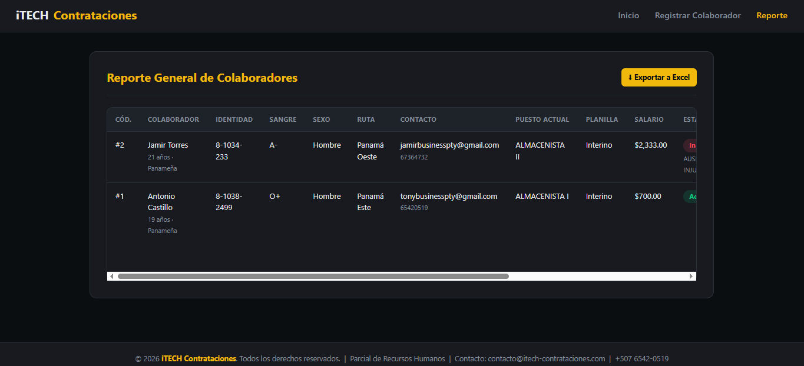

# RRHH - Sistema de Recursos Humanos (PHP + MySQL)

## Objetivo
Sistema web para el registro y control de colaboradores de una empresa, con manejo de perfiles laborales (historial de cargos, salario y promociones), firma digital de datos sensibles y exportación de reportes a Excel. Desarrollado en PHP nativo bajo el patrón de arquitectura Modelo-Vista-Controlador (MVC).

---

## Requisitos Previos

| Tecnología | Versión |
|---|---|
| PHP | 8.3 o superior |
| MySQL | Incluido en WAMP |
| WampServer | 64-bit |
| Composer | Última versión estable (solo para exportar a Excel) |
| Visual Studio Code | Recomendado |
| Sistema Operativo | Windows |

---

## Arquitectura MVC

| Carpeta | Función |
|---|---|
| `config/` | Clase de conexión a la base de datos (PDO) |
| `clases/` | Validación, sanitización y firma digital de datos |
| `modelos/` | Acceso a datos y lógica de negocio (`ColaboradorModelo.php`) |
| `vistas/` | Interfaz de usuario (formulario, reporte, promoción, baja) |
| `css/` | Hoja de estilos del sistema |
| `index.php`, `guardar.php`, `guardar_perfil.php`, `dar_baja.php`, `exportar_excel.php` | Controladores en la raíz del proyecto |

---

## Instalación y Configuración

### 1. Clonar el repositorio
```bash
git clone https://github.com/AntonioCastillo507/RRHH.git
```

### 2. Copiar el proyecto a WampServer
Copia (o mueve) la carpeta clonada dentro de:
```
C:\wamp64\www\RRHH
```

### 3. Crear la base de datos
1. Enciende WampServer (icono verde) y abre `http://localhost/phpmyadmin`
2. Crea una base de datos llamada `parcialdb33`
3. Importa el archivo `database/parcialdb33.sql` incluido en el repositorio (pestaña **Importar**)

### 4. Configurar la conexión
Abre `config/Conexion.php` y confirma que los datos coincidan con tu instalación local:
```php
define('DB_HOST', 'localhost');
define('DB_NAME', 'parcialdb33');
define('DB_USER', 'root');
define('DB_PASS', '');
```

### 5. Ejecutar el proyecto
Abre en el navegador:
```
http://localhost/RRHH/
```

### 6. (Opcional) Exportar reportes a Excel
Desde una consola CMD dentro de la carpeta del proyecto:
```bash
composer require phpoffice/phpspreadsheet
```

---

## Funcionalidades

- Registro de colaboradores (datos personales, contacto, tipo de sangre, sexo, ruta, nacionalidad)
- Registro de perfil laboral: ocupación, tipo de planilla, salario y fecha de inicio
- Firma digital (OpenSSL) de los datos sensibles del perfil laboral, con verificación de integridad en el reporte (verde = íntegro, rojo = alterado)
- Historial de promociones por colaborador (al mejorar de cargo, el anterior se desactiva automáticamente)
- Dar de baja a un colaborador, con motivo de terminación
- Reporte general con historial de cargos separado por comas
- Exportación de reportes a Excel
- Validación y sanitización de datos en clases separadas (nombres y apellidos en formato título)
- Catálogos: estado civil, motivos de terminación, ocupaciones, rutas, sexo, tipo de planilla, tipos de sangre

---

## Resultado


---

## Referencias
- [PHP Official Docs](https://www.php.net)
- [MySQL Documentation](https://dev.mysql.com/doc/)
- [OpenSSL PHP Functions](https://www.php.net/manual/es/book.openssl.php)
- [Bootstrap](https://getbootstrap.com)

---

## Fecha de Ejecución
1 de Julio de 2026

---

| | |
|---|---|
| **Nombre** | Antonio Castillo |
| **Correo** | antonio.castillo2@utp.ac.pa |
| **Curso** | DS7 |
| **Instructor** | Ing. Irina Fong |
